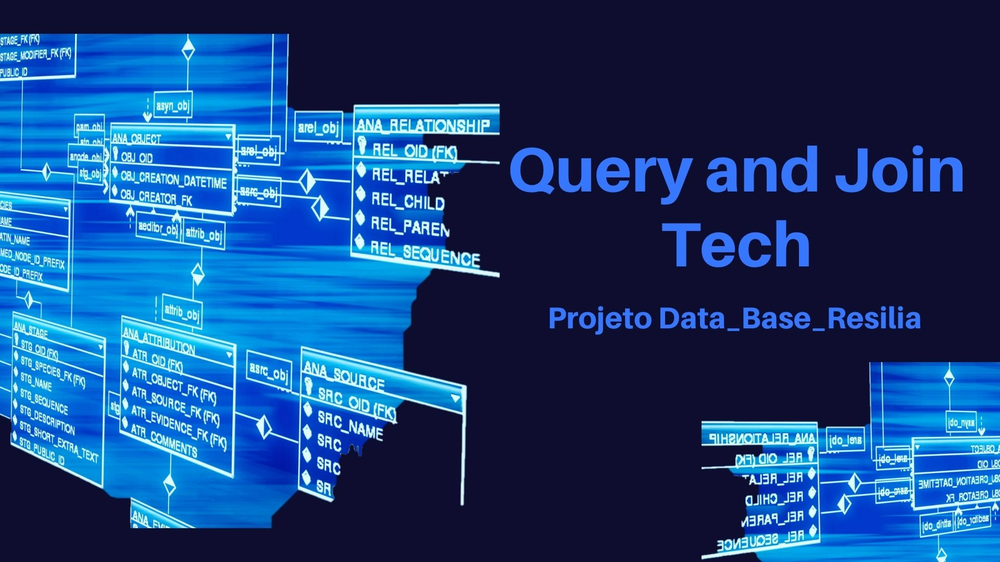

# QUERY-AND-JOIN-TECH

# Índice 

* [Título e Imagem de capa](#Título-e-Imagem-de-capa)
* [Índice](#índice)
* [Descrição do Projeto](#descrição-do-projeto)
* [Funcionalidades](#funcionalidades)
* [Tecnologias utilizadas](#tecnologias-utilizadas)
* [Pessoas Desenvolvedoras do Projeto](#pessoas-desenvolvedoras)

# Descrição do Projeto

Projeto desenvolvido com objetivo de modelar  e implantar um banco de dados para o sistema Resilia, sistema criado de forma fictícia com a finalidade de dar um tema para o projeto em grupo do modulo 03 do curso de Analise de Dados da escola Resília. O sistema ira modernizar o processo de armazenamento de dados e construção para gerenciamento da estrutura de ensino da empresa. Para isso, vocês devem se atentar para o descritivo que será apresentado a seguir:
Hoje dentro da Resilia, são armazenadas diversas informações do braço de ensino da empresa como dados sobre os estudantes, pessoas facilitadoras, turmas, módulos e cursos em planilhas. Essas informações são colocadas em planilhas diferentes, dificultando muitas das vezes a extração de dados
estratégicos para a empresa.

# Funcionalidades

A modelagem possui oito entidades:
* tb_aluno;
* tb_status;
* tb_matricula;
* tb_turma;
* tb_curso;
* tb_modulo;
* tb_facilitador;
* tb_facilitador_turma

Perguntas Respondidas :

* empresa - area (n para n);
* area - tecnologia (n para n);
* area - projeto (1 para n);
* tecnologia - projeto (1 para n);
* projeto - contrato (1 para n)
* empresa - contrato (1 para n);
* colaborador - contrato (1 para 1 )

# Tecnologias Utilizadas
- Draw.io
- Mysql Workbench
- PostegreSql
- Bloco de notas

# Pessoas Desenvolvedoras do Projeto
Esse projeto foi desenvolvido por Alice Campos, Matheus, Aron e Danylo Miranda.